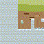
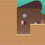

# Mini-Genie

A minimal implementation of [Genie: Generative Interactive Environments](https://arxiv.org/abs/2402.15391) for educational purposes.

Genie learns to generate playable 2D environments from video — without action labels. You can prompt it with an image and "play" by selecting latent actions.

## Architecture

Three models work together:

1. **Video Tokenizer** (VQ-VAE): Compresses 64×64 frames → 16×16 discrete tokens
2. **Latent Action Model (LAM)**: Discovers actions from unlabeled video
3. **Dynamics Model**: Predicts next frame tokens given current tokens + action

## Training Results

Trained on 1M 64×64 CoinRun frames on an A100 GPU.

| Model | Parameters | Final Loss |
|-------|------------|------------|
| Video Tokenizer | 4.47M | recon=0.0005, vq=0.0005, codes=50/1024 |
| LAM | 82.37M | lam=0.0054 |
| Dynamics | 6.92M | dyn=0.9470 |
| **Total** | **~94M** | |

## Demo

<p float="left">
  
  
</p>

Both sequences use action 3 (the only action that works due to LAM collapse). first is 21 frames, second 30

### What Worked
- **Video tokenizer** — encodes/decodes frames with near-perfect reconstruction
- **Dynamics model** — predicts next frame tokens given correct action almost in real time
- **Full pipeline** — end-to-end training completed successfully

### What Didn't Work
- **LAM collapsed to single action** — all 8 latent actions mapped to action 3 (codebook collapse). The model "works" but only learned one action instead of diverse movements like left/right/jump.

Possible fixes:
- Higher `commitment_cost` in LAM config
- More diverse action collection
- Longer training or different architecture

## Setup

```bash
uv sync
```

Requires Python ≤3.10 for data collection (procgen dependency). Training and inference work on Python 3.12.
For training, I rented a GPU on Vast.ai and this worked since pyproject.toml has 3.12:
```bash
sed -i 's/requires-python = ">=3.12"/requires-python = ">=3.10"/' pyproject.toml
sed -i 's/numpy>=2.3.5/numpy>=1.17.0,<2.0.0/' pyproject.toml
sed -i '/"wandb>=0.23.1",/a\    "procgen>=0.10.7",' pyproject.toml
uv python pin 3.10
uv sync
```

## Training

### Full pipeline:

```bash
# 1. Collect CoinRun data (~4 minutes)
# 2. Train tokenizer (~15 minutes)
# 3. Train LAM + dynamics (~8 hours)
uv run python scripts/train.py --device cuda
```

### Run phases separately:

```bash
# 1. Collect data
uv run python scripts/train.py --phase collect

# 2. Train tokenizer
uv run python scripts/train.py --phase tokenizer --tokenizer_steps 50000

# 3. Train dynamics and LAM (requires trained tokenizer)
uv run python scripts/train.py --phase dynamics --dynamics_steps 50000
```

## Play

After training:

```bash
# Interactive mode
uv run python scripts/play.py --output_dir outputs --use_dataset_frame

# Batch generation
uv run python scripts/play.py --output_dir outputs --actions "3,3,3,3,3,3"
```

Due to LAM collapse, only action 3 produces sensible outputs. Other actions (0,1,2,4,5,6,7) generate garbage.

## Project Structure

```
mini-genie/
├── configs/
│   └── default.py          # All hyperparameters
├── genie/
│   ├── data/
│   │   └── coinrun.py      # Data collection & dataset
│   ├── models/
│   │   ├── video_tokenizer.py
│   │   ├── lam.py
│   │   └── dynamics.py
│   └── train/
│       ├── train_tokenizer.py
│       └── train_dynamics.py
├── play_output/
│   └── frame_xyz.png       # Initial and predicted frames
└── scripts/
    ├── train.py            # Main training entrypoint
    └── play.py             # Interactive play
```

## Simplifications from Paper

| Paper | Mini-Genie | Why |
|-------|------------|-----|
| ST-Transformer tokenizer | CNN-based | Simpler, faster |
| 11B parameters | ~94M parameters | Fits on single A100 GPU |
| 16 frame context | 8 frame context | Less memory |
| 300k + 200k steps | 50k + 50k steps | Faster iteration |

## References

- [Genie Paper](https://arxiv.org/abs/2402.15391) - Bruce et al., 2024
- [MaskGIT](https://arxiv.org/abs/2202.04200) - Chang et al., 2022 (used for dynamics model)
- [VQ-VAE](https://arxiv.org/abs/1711.00937) - van den Oord et al., 2017 (used for tokenizer)
